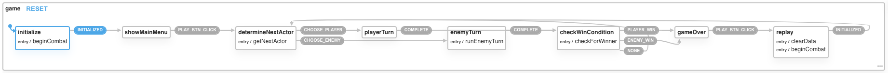

# D&D HTTP Combat Minigame

## Startup

You can run `make start` to build the Docker environment hosting redis, the express server, and the client application on `http://localhost:8000`. Alternatively, you can use  `make start-local`, which will mount local volumes, use local config, and store redis data on the local filesystem. The local version allows you to recompile the client (or watch->compile) for local development.

## Platforms

This application has been tested on the following platforms/builds with the following Node and npm versions:

```
Mac OSX Catalina 10.15.6 (19G2021
node v12.16.0 with npm 6.13.4
```

and was tested in the following browsers:

```
Brave
Chrome
Safari
```

## Server

You can run the server locally with `npm run start:server` - this will run on port `8081` aka `http://localhost:8081`, and allow you to run cURL commands against it. However, you will need a redis instance running.

## Client


You can visualize the XState chart [here](https://xstate.js.org/viz/?gist=70eae880cc0e152d499dcfad5e82ea8a), but for brevity, the screenshot below is a visual outline of the client state management:



## Known Issues

1. Running `npm test` on Mac OSX outputs the following error due to an [issue](https://github.com/facebook/jest/issues/10777) with `fsevents` on MacOSX:
```
Force exiting Jest: Have you considered using `--detectOpenHandles` to detect async operations that kept running after all tests finished?
```

2. Client-side compile is slow due to some of the inclusion of Three.js. In order to use Three.js properly, it should probably be utilized as ES6 modules as intended to avoid the load time. The following errors are produced:
```
[BABEL] Note: The code generator has deoptimised the styling of node_modules/three/build/three.js as it exceeds the max of 500KB.
[BABEL] Note: The code generator has deoptimised the styling of node_modules/three/build/three.module.js as it exceeds the max of 500KB.
```

3. I die really fast! It is possible your character is generated with so few hit points that you die immediately, or, that the goblin is generated with so few hit points it dies on the first hit.

4. Why are all the commits so close together in time? I built this application in a separate folder, and then copied/moved files into this repo to make more intentful commits that will propery compartmentalize ccertain parts of the project. I figured this would be more readable.
