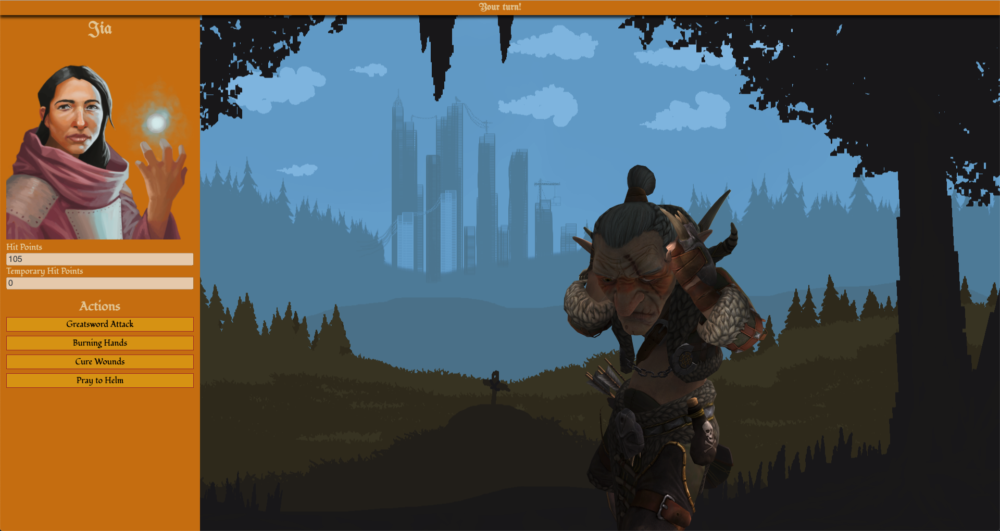

# D&D HTTP Combat Minigame

## Server

## Client



You can visualize the XState chart [here](https://xstate.js.org/viz/?gist=70eae880cc0e152d499dcfad5e82ea8a), but for brevity, the screenshot below is a visual outline of the client state management:


## Known Issues

1. Running `npm test` on Mac OSX outputs the following error due to an [issue](https://github.com/facebook/jest/issues/10777) with `fsevents` on MacOSX:
```
Force exiting Jest: Have you considered using `--detectOpenHandles` to detect async operations that kept running after all tests finished?
```

2. Client-side compile is slow due to some of the inclusion of Three.js. In order to use Three.js properly, it should probably be utilized as ES6 modules as intended to avoid the load time. The following errors are produced:
```
[BABEL] Note: The code generator has deoptimised the styling of node_modules/three/build/three.js as it exceeds the max of 500KB.
[BABEL] Note: The code generator has deoptimised the styling of node_modules/three/build/three.module.js as it exceeds the max of 500KB.
```

3. I die really fast! It is possible your character is generated with so few hit points that you die immediately, or, that the goblin is generated with so few hit points it dies on the first hit.
